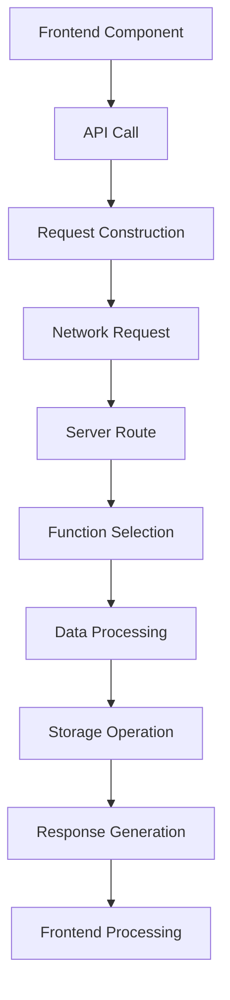

# Debugging Methodology & Best Practices

## 📋 Overview

Dokumen ini menjelaskan metodologi debugging yang sistematis untuk mengatasi masalah dalam aplikasi MVDB, khususnya untuk masalah server-side dan data flow.

## 🔍 Systematic Debugging Approach

### 1. Frontend-First Investigation
**Principle**: Start from where the problem is visible

#### Steps:
1. **Check Browser Console**
   ```javascript
   // Look for error messages, warnings, and API responses
   console.log('API response:', response)
   console.log('Data received:', data)
   ```

2. **Network Tab Analysis**
   - Check request payload
   - Verify response status
   - Examine response data structure
   - Look for missing fields

3. **Component State Inspection**
   ```javascript
   // Log component state changes
   console.log('Component state:', state)
   console.log('Props received:', props)
   ```

### 2. API Layer Investigation
**Principle**: Trace data flow through API calls

#### Steps:
1. **Request Construction**
   ```javascript
   // Log request data before sending
   console.log('Request payload:', payload)
   console.log('API endpoint:', endpoint)
   ```

2. **Response Processing**
   ```javascript
   // Log response processing
   console.log('Raw response:', response)
   console.log('Processed data:', processedData)
   ```

3. **Error Handling**
   ```javascript
   // Log error details
   console.log('Error occurred:', error)
   console.log('Error details:', error.details)
   ```

### 3. Server-Side Investigation
**Principle**: Examine server logic and data processing

#### Steps:
1. **Route Analysis**
   ```typescript
   // Check which route is being called
   console.log('Route called:', route)
   console.log('Route parameters:', params)
   ```

2. **Function Selection**
   ```typescript
   // Verify which function handles the request
   console.log('Function selected:', functionName)
   console.log('Function type:', type)
   ```

3. **Data Processing**
   ```typescript
   // Log data processing steps
   console.log('Input data:', inputData)
   console.log('Processed data:', processedData)
   console.log('Output data:', outputData)
   ```

## 🛠️ Debugging Tools & Techniques

### 1. Console Logging Strategy

#### Frontend Logging
```javascript
// Structured logging with context
console.log('Component: LineupManagement - Action: Update Actress', {
  actressId,
  actressName,
  lineupId,
  updateData
})

// API call logging
console.log('API call - updateExtended:', {
  type: 'actress',
  id: actressId,
  data: updateData
})

// Response logging
console.log('API success response:', response)
console.log('API success response data:', response.data)
console.log('API success response data lineupData:', response.data.lineupData)
```

#### Server-Side Logging
```typescript
// Function entry logging
console.log(`Server: Updating extended master data with sync for type: ${type}, id: ${id}`)

// Data processing logging
console.log(`Server: Updating ${type} ${id} with data:`, body)

// Field-specific logging
console.log(`Server: lineupData received:`, lineupData)
console.log(`Server: lineupData type:`, typeof lineupData)
console.log(`Server: lineupData keys:`, lineupData ? Object.keys(lineupData) : 'undefined')

// Processing result logging
console.log(`Server: Processed lineupData:`, processedLineupData)
```

### 2. Data Flow Tracing

#### Request Flow


#### Debugging Points
1. **Frontend**: Log data before API call
2. **Network**: Check request payload
3. **Server**: Log received data
4. **Processing**: Log each transformation step
5. **Storage**: Log saved data
6. **Response**: Log returned data
7. **Frontend**: Log received response

### 3. Error Pattern Recognition

#### Common Error Patterns

##### Pattern 1: Missing Field Processing
**Symptoms**:
- Field sent in request
- Field undefined in response
- Data not saved

**Debugging Steps**:
1. Check request body extraction
2. Verify field destructuring
3. Check field processing logic
4. Verify field inclusion in response

##### Pattern 2: Wrong Function Called
**Symptoms**:
- Unexpected behavior
- Missing functionality
- Type errors

**Debugging Steps**:
1. Check route pattern matching
2. Verify function selection logic
3. Check type validation
4. Verify function capabilities

##### Pattern 3: Data Type Mismatch
**Symptoms**:
- Type errors
- Unexpected data structure
- Processing failures

**Debugging Steps**:
1. Check data type validation
2. Verify data structure
3. Check type casting
4. Verify interface compliance

## 🔧 Troubleshooting Checklist

### Pre-Debugging Setup
- [ ] Enable detailed console logging
- [ ] Check browser developer tools
- [ ] Verify network connectivity
- [ ] Confirm server deployment status

### Frontend Debugging
- [ ] Check component state
- [ ] Verify props and data flow
- [ ] Check API call construction
- [ ] Verify error handling
- [ ] Check response processing

### Server Debugging
- [ ] Check route matching
- [ ] Verify function selection
- [ ] Check request body parsing
- [ ] Verify data processing logic
- [ ] Check response construction
- [ ] Verify error handling

### Data Flow Debugging
- [ ] Trace data from frontend to server
- [ ] Check data transformations
- [ ] Verify storage operations
- [ ] Check response data
- [ ] Verify frontend processing

## 📊 Debugging Case Study: LineupData Undefined

### Problem Statement
Actress updates with lineup data were returning `lineupData: undefined` in API response.

### Debugging Process

#### Step 1: Frontend Analysis
```javascript
// Console logs showed:
Updating actress with lineup data: {
  actressId: '1755620001114-pksq9ik06',
  actressName: 'Mei Washio',
  lineupId: '515686d2-cbef-4519-b736-b02889be2e85',
  updateData: {...}
}

// Request payload included lineupData:
{
  "lineupData": {
    "515686d2-cbef-4519-b736-b02889be2e85": {
      "alias": "Jun Kakei - 筧ジュン"
    }
  }
}

// But response showed:
{
  lineupData: undefined // ❌ PROBLEM
}
```

#### Step 2: API Layer Analysis
- Request construction: ✅ Correct
- Network request: ✅ Successful (200 status)
- Response processing: ❌ Missing lineupData

#### Step 3: Server-Side Investigation
```typescript
// Found routing issue:
PUT /master/:type/:id/extended/sync
├── updateExtendedMasterDataWithSync() // Used for actress
│   ├── ❌ Missing lineupData handling
│   └── ❌ Not extracting lineupData from request
│
PUT /master/:type/:id/extended  
├── updateExtendedMasterData() // Used for lineup
│   ├── ✅ Has lineupData handling
│   └── ✅ Processes lineupData correctly
```

#### Step 4: Root Cause Identification
- **Function**: `updateExtendedMasterDataWithSync`
- **Issue**: Missing `lineupData` field processing
- **Impact**: Data sent but not processed or returned

#### Step 5: Solution Implementation
```typescript
// Added lineupData to destructuring:
const { name, jpname, ..., lineupData } = body

// Added lineupData processing:
let processedLineupData = existingItem.lineupData || {}
if (lineupData !== undefined && lineupData !== null) {
  processedLineupData = { ...processedLineupData, ...lineupData }
}

// Added lineupData to response:
const updatedItem = {
  ...existingItem,
  lineupData: processedLineupData,
  // ... other fields
}
```

#### Step 6: Verification
- [ ] Deploy changes to server
- [ ] Test actress update with lineup data
- [ ] Verify lineupData in response
- [ ] Confirm data persistence

## 🚀 Best Practices

### 1. Logging Standards
- **Structured Logging**: Use consistent format
- **Context Information**: Include relevant identifiers
- **Level Appropriateness**: Use appropriate log levels
- **Performance Consideration**: Avoid excessive logging in production

### 2. Error Handling
- **Graceful Degradation**: Handle errors without breaking functionality
- **Detailed Error Messages**: Provide actionable error information
- **Error Recovery**: Implement retry mechanisms where appropriate
- **User-Friendly Messages**: Translate technical errors for users

### 3. Data Validation
- **Input Validation**: Validate all inputs at boundaries
- **Type Checking**: Ensure data types match expectations
- **Range Validation**: Check data within acceptable ranges
- **Format Validation**: Verify data format compliance

### 4. Testing Strategy
- **Unit Tests**: Test individual functions
- **Integration Tests**: Test component interactions
- **End-to-End Tests**: Test complete user workflows
- **Error Scenario Tests**: Test error handling paths

## 📚 Related Documentation

- [LineupData Undefined Troubleshooting](./lineup-data-undefined-troubleshooting.md)
- [Server Routing Architecture](./server-routing-architecture.md)
- [Master Data API Guidelines](./api-guidelines.md)
- [Implementation Patterns](./implementation-patterns.md)

---

**Last Updated**: 2025-01-15  
**Version**: 1.0  
**Status**: ✅ Best Practices Guide
