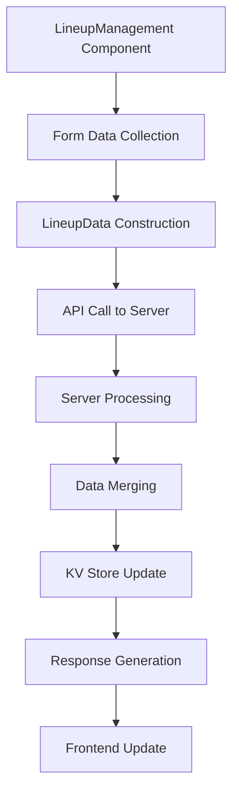

# LineupData Implementation Technical Details

## 📋 Overview

Dokumen ini menjelaskan implementasi teknis lengkap untuk sistem LineupData, termasuk struktur data, processing logic, dan integration patterns.

## 🏗️ Data Structure Architecture

### LineupData Schema

#### Frontend Structure
```typescript
interface LineupData {
  [lineupId: string]: {
    alias?: string           // Actress alias in this lineup
    profilePicture?: string  // Actress profile picture in this lineup
  }
}

// Example:
const lineupData = {
  "515686d2-cbef-4519-b736-b02889be2e85": {
    alias: "Jun Kakei - 筧ジュン",
    profilePicture: "https://example.com/photo.jpg"
  },
  "another-lineup-id": {
    alias: "Different Alias",
    profilePicture: "https://example.com/photo2.jpg"
  }
}
```

#### Server-Side Structure
```typescript
interface MasterDataItem {
  id: string
  name: string
  type: string
  lineupData?: Record<string, {
    alias?: string
    profilePicture?: string
  }>
  // ... other fields
}
```

### Data Flow Architecture



## 🔧 Implementation Details

### 1. Frontend Implementation

#### LineupManagement Component
```typescript
// Data collection and processing
const updateData = {
  name: actress.name,
  alias: formData.actressAliases[actressId] || undefined,
  selectedGroups: actress.selectedGroups || [],
  generationData: actress.generationData || {},
  lineupData: {
    ...(actress.lineupData || {}), // Preserve existing lineup data
    [createdLineup.id]: {
      alias: formData.actressAliases[actressId] || undefined,
      profilePicture: formData.actressProfilePictures[actressId] || undefined
    }
  }
}

// API call with logging
console.log('Updating actress with lineup data:', {
  actressId,
  actressName: actress.name,
  lineupId: createdLineup.id,
  updateData
})

await masterDataApi.updateExtended('actress', actressId, updateData, accessToken)
```

#### MasterDataApi Integration
```typescript
// API call construction
const response = await fetch(`${API_BASE_URL}/master/${type}/${id}/extended/sync`, {
  method: 'PUT',
  headers: {
    'Content-Type': 'application/json',
    'Authorization': `Bearer ${accessToken}`
  },
  body: JSON.stringify(data)
})

// Response processing with logging
console.log('API success response:', response)
console.log('API success response data:', response.data)
console.log('API success response data lineupData:', response.data.lineupData)
```

### 2. Server-Side Implementation

#### Request Processing
```typescript
// Request body extraction
const body = await c.req.json()
const { 
  name, jpname, kanjiName, kanaName, birthdate, alias, 
  links, takulinks, tags, photo, profilePicture, 
  groupId, selectedGroups, groupData, generationData, 
  lineupData // ✅ Extracted from request
} = body

console.log(`Server: Updating ${type} ${id} with data:`, body)
```

#### LineupData Processing Logic
```typescript
// Process lineupData - merge with existing data
let processedLineupData = existingItem.lineupData || {}
if (lineupData !== undefined && lineupData !== null) {
  if (typeof lineupData === 'object' && !Array.isArray(lineupData)) {
    processedLineupData = {
      ...processedLineupData,
      ...lineupData
    }
    console.log(`Server: Processed lineupData:`, processedLineupData)
  } else {
    console.log(`Server: Invalid lineupData format, keeping existing:`, existingItem.lineupData)
  }
}
```

#### Response Construction
```typescript
const updatedItem = {
  ...existingItem,
  name: newName,
  jpname: jpname?.trim() || undefined,
  kanjiName: kanjiName?.trim() || undefined,
  kanaName: kanaName?.trim() || undefined,
  birthdate: birthdate?.trim() || undefined,
  alias: alias?.trim() || (alias === null || alias === '' ? undefined : existingItem.alias),
  links: processedLinks,
  tags: tags?.trim() || undefined,
  photo: finalPhotoArray,
  profilePicture: finalProfilePicture,
  groupId: groupId?.trim() || undefined,
  selectedGroups: Array.isArray(selectedGroups) && selectedGroups.length > 0 ? selectedGroups : undefined,
  groupData: groupData || undefined,
  generationData: generationData !== undefined ? generationData : existingItem.generationData,
  lineupData: processedLineupData, // ✅ Included in response
  updatedAt: new Date().toISOString()
}
```

### 3. Data Persistence

#### KV Store Operations
```typescript
// Save updated item to KV store
await kv.set(`master_${type}_${id}`, JSON.stringify(updatedItem))

// Key pattern: master_actress_{id}
// Example: master_actress_1755620001114-pksq9ik06
```

#### Data Retrieval
```typescript
// Retrieve existing item
const existingData = await kv.get(`master_${type}_${id}`)
if (!existingData) {
  return c.json({ error: 'Item not found' }, 404)
}

const existingItem = JSON.parse(existingData)
```

## 🔄 Data Merging Strategy

### Merge Logic
```typescript
// Preserve existing lineup data and merge new data
let processedLineupData = existingItem.lineupData || {}

if (lineupData !== undefined && lineupData !== null) {
  if (typeof lineupData === 'object' && !Array.isArray(lineupData)) {
    // Merge new lineup data with existing
    processedLineupData = {
      ...processedLineupData,  // Existing lineup data
      ...lineupData            // New lineup data
    }
  }
}
```

### Merge Examples

#### Example 1: Adding New Lineup
```typescript
// Existing data
existingItem.lineupData = {
  "lineup-1": { alias: "Alias 1" }
}

// New data
lineupData = {
  "lineup-2": { alias: "Alias 2" }
}

// Result
processedLineupData = {
  "lineup-1": { alias: "Alias 1" },
  "lineup-2": { alias: "Alias 2" }
}
```

#### Example 2: Updating Existing Lineup
```typescript
// Existing data
existingItem.lineupData = {
  "lineup-1": { alias: "Old Alias" }
}

// New data
lineupData = {
  "lineup-1": { alias: "New Alias" }
}

// Result
processedLineupData = {
  "lineup-1": { alias: "New Alias" }
}
```

## 🛡️ Validation & Error Handling

### Input Validation
```typescript
// Type validation
if (!type || !['actor', 'actress', 'director'].includes(type)) {
  return c.json({ error: 'Invalid type parameter' }, 400)
}

// ID validation
if (!id) {
  return c.json({ error: 'ID is required' }, 400)
}

// Name validation
if (!name?.trim()) {
  return c.json({ error: 'Name is required' }, 400)
}
```

### LineupData Validation
```typescript
// Validate lineupData structure
if (lineupData !== undefined && lineupData !== null) {
  if (typeof lineupData === 'object' && !Array.isArray(lineupData)) {
    // Valid object - proceed with processing
    processedLineupData = { ...processedLineupData, ...lineupData }
  } else {
    // Invalid format - log warning and keep existing
    console.log(`Server: Invalid lineupData format, keeping existing:`, existingItem.lineupData)
  }
}
```

### Error Response Format
```typescript
// Success response
return c.json({ 
  data: updatedItem,
  sync: syncResults
})

// Error response
return c.json({ 
  error: `Failed to update extended master data: ${error.message}`,
  details: error?.stack
}, 500)
```

## 🔍 Debugging & Logging

### Frontend Logging
```typescript
// Component-level logging
console.log('Updating actress with lineup data:', {
  actressId,
  actressName: actress.name,
  lineupId: createdLineup.id,
  updateData
})

// API-level logging
console.log('API call - updateExtended:', {
  type: 'actress',
  id: actressId,
  data: updateData
})

// Response logging
console.log('API success response:', response)
console.log('API success response data lineupData:', response.data.lineupData)
```

### Server-Side Logging
```typescript
// Function entry logging
console.log(`Server: Updating extended master data with sync for type: ${type}, id: ${id}`)

// Data processing logging
console.log(`Server: lineupData received:`, lineupData)
console.log(`Server: lineupData type:`, typeof lineupData)
console.log(`Server: lineupData keys:`, lineupData ? Object.keys(lineupData) : 'undefined')

// Processing result logging
console.log(`Server: Processed lineupData:`, processedLineupData)
```

## 🚀 Performance Considerations

### Data Size Optimization
- **Minimal Data Structure**: Only store necessary fields
- **Efficient Merging**: Use spread operator for shallow merge
- **Conditional Processing**: Only process when data exists

### Memory Management
- **Object Reuse**: Reuse existing objects where possible
- **Garbage Collection**: Avoid creating unnecessary objects
- **Data Cleanup**: Remove undefined/null values

### Network Optimization
- **Payload Size**: Minimize request/response size
- **Compression**: Use JSON compression where appropriate
- **Caching**: Implement response caching for read operations

## 🧪 Testing Strategy

### Unit Tests
```typescript
// Test lineupData processing
describe('LineupData Processing', () => {
  it('should merge new lineup data with existing', () => {
    const existing = { "lineup-1": { alias: "Alias 1" } }
    const newData = { "lineup-2": { alias: "Alias 2" } }
    const result = mergeLineupData(existing, newData)
    
    expect(result).toEqual({
      "lineup-1": { alias: "Alias 1" },
      "lineup-2": { alias: "Alias 2" }
    })
  })
})
```

### Integration Tests
```typescript
// Test complete flow
describe('Actress Update with LineupData', () => {
  it('should update actress with lineup data', async () => {
    const updateData = {
      name: 'Test Actress',
      lineupData: {
        'test-lineup': { alias: 'Test Alias' }
      }
    }
    
    const response = await updateActress('test-id', updateData)
    expect(response.data.lineupData).toBeDefined()
    expect(response.data.lineupData['test-lineup']).toEqual({ alias: 'Test Alias' })
  })
})
```

## 📚 Related Documentation

- [LineupData Undefined Troubleshooting](./lineup-data-undefined-troubleshooting.md)
- [Server Routing Architecture](./server-routing-architecture.md)
- [Debugging Methodology](./debugging-methodology.md)
- [Master Data API Guidelines](./api-guidelines.md)

---

**Last Updated**: 2025-01-15  
**Version**: 1.0  
**Status**: ✅ Implementation Complete
