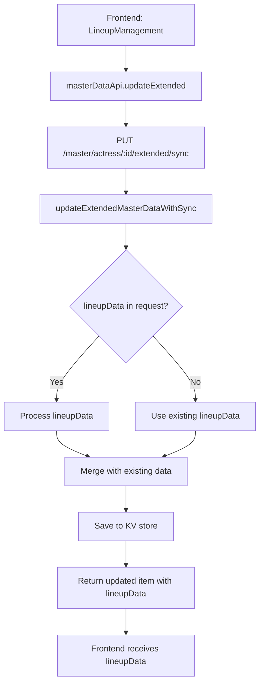

# LineupData Undefined Troubleshooting Guide

## 📋 Overview

Dokumen ini menjelaskan troubleshooting lengkap untuk masalah `lineupData: undefined` yang terjadi ketika mengupdate actress dengan lineup information. Masalah ini terjadi karena fungsi server-side tidak menangani field `lineupData` dengan benar.

## 🔍 Root Cause Analysis

### Masalah Utama
- **Fungsi `updateExtendedMasterDataWithSync` tidak menangani field `lineupData`**
- Ketika actress di-update melalui routing `/master/:type/:id/extended/sync`, fungsi ini digunakan tetapi tidak memproses `lineupData` dari request body
- Server menerima `lineupData` dalam request tetapi tidak menyimpannya atau mengembalikannya dalam response

### Technical Details
- **Routing yang digunakan**: `PUT /make-server-e0516fcf/master/:type/:id/extended/sync`
- **Fungsi yang dipanggil**: `updateExtendedMasterDataWithSync`
- **File yang bermasalah**: 
  - `supabase/functions/make-server-e0516fcf/updateMasterDataWithSync.ts`
  - `src/supabase/functions/server/updateMasterDataWithSync.tsx`

## 🏗️ Architecture & Routing Hierarchy

### Server-Side Routing Structure
```
PUT /make-server-e0516fcf/master/:type/:id/extended/sync
├── updateExtendedMasterDataWithSync() [MAIN FUNCTION]
│   ├── Validates type (actor, actress, director)
│   ├── Extracts request body
│   ├── Processes links, photos, etc.
│   └── ❌ MISSING: lineupData processing
│
PUT /make-server-e0516fcf/master/:type/:id/extended
├── updateExtendedMasterData() [ALTERNATIVE FUNCTION]
│   ├── Used for lineup type only
│   ├── ✅ HAS: lineupData processing
│   └── Not used for actress updates
```

### Frontend API Flow
```
LineupManagement.tsx
├── masterDataApi.updateExtended('actress', actressId, updateData)
├── PUT /make-server-e0516fcf/master/actress/:id/extended/sync
└── updateExtendedMasterDataWithSync() [PROBLEMATIC]
```

## 🛠️ Solution Implementation

### 1. Interface Update
```typescript
// Master data item interface for type safety
interface MasterDataItem {
  id: string
  name?: string
  // ... other fields
  lineupData?: any // Lineup data for actresses
  updatedAt?: string
}
```

### 2. Request Body Extraction
```typescript
const body = await c.req.json()
const { 
  name, jpname, kanjiName, kanaName, birthdate, alias, 
  links, takulinks, tags, photo, profilePicture, 
  groupId, selectedGroups, groupData, generationData, 
  lineupData // ✅ ADDED
} = body
```

### 3. LineupData Processing Logic
```typescript
// Process lineupData - merge with existing data
let processedLineupData = existingItem.lineupData || {}
if (lineupData !== undefined && lineupData !== null) {
  if (typeof lineupData === 'object' && !Array.isArray(lineupData)) {
    processedLineupData = {
      ...processedLineupData,
      ...lineupData
    }
    console.log(`Server: Processed lineupData:`, processedLineupData)
  } else {
    console.log(`Server: Invalid lineupData format, keeping existing:`, existingItem.lineupData)
  }
}
```

### 4. Response Object Update
```typescript
const updatedItem = {
  ...existingItem,
  name: newName,
  // ... other fields
  lineupData: processedLineupData, // ✅ ADDED
  updatedAt: new Date().toISOString()
}
```

## 🔧 Files Modified

### Primary Files
1. **`supabase/functions/make-server-e0516fcf/updateMasterDataWithSync.ts`**
   - Added `lineupData` to interface
   - Added `lineupData` extraction from request body
   - Added lineupData processing logic
   - Added `lineupData` to response object

2. **`src/supabase/functions/server/updateMasterDataWithSync.tsx`**
   - Same changes as above (mirror file)

### Deployment
- **Command**: `npx supabase functions deploy make-server-e0516fcf`
- **Status**: ✅ Successfully deployed
- **Files uploaded**: All server files including updated `updateMasterDataWithSync.ts`

## 🐛 Debugging Process

### 1. Frontend Logs Analysis
```javascript
// Console logs showed:
Updating actress with lineup data: {
  actressId: '1755620001114-pksq9ik06', 
  actressName: 'Mei Washio', 
  lineupId: '515686d2-cbef-4519-b736-b02889be2e85', 
  updateData: {...}
}

// JSON payload being sent:
{
  "name": "Mei Washio",
  "alias": "Jun Kakei - 筧ジュン",
  "selectedGroups": ["8woman"],
  "generationData": {...},
  "lineupData": {
    "515686d2-cbef-4519-b736-b02889be2e85": {
      "alias": "Jun Kakei - 筧ジュン"
    }
  }
}

// API response data:
{
  id: '1755620001114-pksq9ik06',
  name: 'Mei Washio',
  // ... other fields
  lineupData: undefined // ❌ PROBLEM
}
```

### 2. Server-Side Investigation
- **Routing analysis**: Found that actress updates use `updateExtendedMasterDataWithSync`
- **Function inspection**: Discovered missing `lineupData` handling
- **Code comparison**: Compared with `updateExtendedMasterData` which had lineupData support

### 3. Solution Verification
- **Interface updates**: Added `lineupData?: any` to `MasterDataItem`
- **Request processing**: Added `lineupData` to destructuring
- **Data merging**: Implemented proper merging logic
- **Response inclusion**: Added `lineupData` to returned object

## 📊 Data Flow Diagram



## 🚨 Common Issues & Solutions

### Issue 1: lineupData undefined in response
**Symptoms**: 
- Frontend sends lineupData in request
- Server returns lineupData: undefined
- Actress not properly assigned to lineup

**Solution**: 
- Ensure `updateExtendedMasterDataWithSync` handles lineupData
- Add lineupData to interface and processing logic

### Issue 2: Refresh loop in LineupDisplay
**Symptoms**: 
- Component continuously re-renders
- Infinite API calls

**Solution**: 
- Modify `onDataChange` callback in `GroupDetailContent.tsx`
- Avoid triggering refresh loops

### Issue 3: Type errors in server functions
**Symptoms**: 
- Duplicate identifier errors
- Type assignment errors

**Solution**: 
- Rename conflicting fields (e.g., `groupId` → `generationGroupId`)
- Add explicit type annotations

## 🔍 Testing Checklist

### Before Fix
- [ ] Create lineup
- [ ] Assign actress to lineup
- [ ] Check API response for lineupData
- [ ] Verify lineupData is undefined ❌

### After Fix
- [ ] Create lineup
- [ ] Assign actress to lineup
- [ ] Check API response for lineupData
- [ ] Verify lineupData is properly returned ✅
- [ ] Verify actress appears in lineup display ✅

## 📝 Key Learnings

1. **Routing Consistency**: Different routes use different functions, ensure all handle required fields
2. **Interface Completeness**: Keep interfaces in sync across all server functions
3. **Data Merging**: Implement proper merging logic for complex data structures
4. **Debugging Strategy**: Use systematic approach - frontend logs → routing analysis → function inspection
5. **Deployment Verification**: Always deploy and test changes in production environment

## 🚀 Future Improvements

1. **Type Safety**: Replace `any` with proper TypeScript interfaces for lineupData
2. **Validation**: Add server-side validation for lineupData structure
3. **Error Handling**: Improve error messages for invalid lineupData formats
4. **Testing**: Add unit tests for lineupData processing logic
5. **Documentation**: Keep this guide updated with any new issues or solutions

## 📚 Related Documentation

- [Lineup Feature Documentation](./lineup-feature.md)
- [Master Data API Guidelines](./api-guidelines.md)
- [Lineup Management Component](./lineup-management.md)
- [Server Function Architecture](./implementation-patterns.md)

---

**Last Updated**: 2025-01-15  
**Version**: 1.0  
**Status**: ✅ Resolved
