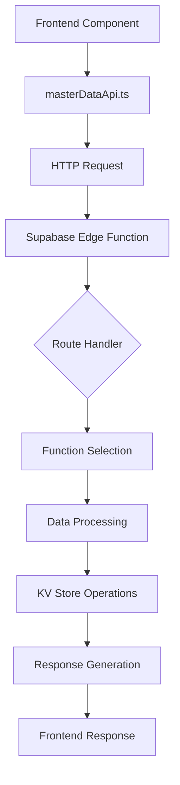

# Server Routing Architecture & Hierarchy

## 📋 Overview

Dokumen ini menjelaskan arsitektur routing server-side untuk Supabase Edge Functions, khususnya untuk master data management dan lineup functionality.

## 🏗️ Server Architecture Overview

### Function Structure
```
supabase/functions/make-server-e0516fcf/
├── index.ts                    # Main routing file
├── masterDataApi.ts           # Master data CRUD operations
├── updateMasterDataWithSync.ts # Extended updates with sync
├── updateGroupData.ts         # Group-specific updates
├── kv_store.ts               # Key-value store operations
└── photobookApi.ts           # Photobook operations
```

## 🛣️ Routing Hierarchy

### Master Data Routes

#### 1. Simple Master Data (Type, Tag)
```
GET    /master/:type                    # List all items
POST   /master/:type                    # Create new item
PUT    /master/:type/:id/sync          # Update with sync
DELETE /master/:type/:id               # Delete item
```

#### 2. Extended Master Data (Actor, Actress, Director)
```
GET    /master/:type                    # List all items
POST   /master/:type/extended          # Create with extended fields
PUT    /master/:type/:id/extended/sync # Update with sync + extended fields
DELETE /master/:type/:id               # Delete item
```

#### 3. Specialized Routes
```
# Series
PUT    /master/series/:id/extended     # Update series with dual titles

# Studio  
PUT    /master/studio/:id/extended     # Update studio with links

# Label
PUT    /master/label/:id/extended      # Update label with links

# Group
PUT    /master/group/:id/extended      # Update group with gallery

# Lineup
POST   /master/lineup/extended         # Create lineup
PUT    /master/lineup/:id/extended    # Update lineup
```

## 🔄 Function Mapping

### Request → Function Mapping

| Route Pattern | Function Used | Purpose |
|---------------|---------------|---------|
| `PUT /master/:type/:id/extended/sync` | `updateExtendedMasterDataWithSync` | Extended updates with movie sync |
| `PUT /master/:type/:id/extended` | `updateExtendedMasterData` | Extended updates without sync |
| `PUT /master/lineup/:id/extended` | `updateExtendedMasterData` | Lineup-specific updates |
| `PUT /master/group/:id/extended` | `updateGroupData` | Group-specific updates |

### Type-Specific Routing Logic

```typescript
// In index.ts - Route handler
app.put('/make-server-e0516fcf/master/:type/:id/extended', async (c) => {
  const type = c.req.param('type')
  
  // Use updateExtendedMasterData for lineup, updateExtendedMasterDataWithSync for others
  if (type === 'lineup') {
    return await updateExtendedMasterData(c)
  } else {
    return await updateExtendedMasterDataWithSync(c)
  }
})
```

## 📊 Data Flow Architecture

### Frontend → Backend Flow



### Function Selection Logic

```typescript
// Extended Master Data Updates
if (type === 'lineup') {
  // Use updateExtendedMasterData (has lineupData support)
  return await updateExtendedMasterData(c)
} else if (type === 'group') {
  // Use updateGroupData (group-specific logic)
  return await updateGroupData(c)
} else {
  // Use updateExtendedMasterDataWithSync (with movie sync)
  return await updateExtendedMasterDataWithSync(c)
}
```

## 🔧 Function Responsibilities

### updateExtendedMasterDataWithSync
**Purpose**: Handle extended updates for actor/actress/director with movie synchronization
**Features**:
- ✅ Name change sync across movies
- ✅ Photo processing and deduplication
- ✅ Links processing
- ✅ Group data handling
- ✅ Generation data handling
- ✅ **LineupData handling** (Fixed in latest version)

**Supported Types**: `actor`, `actress`, `director`

### updateExtendedMasterData
**Purpose**: Handle extended updates for lineup without movie sync
**Features**:
- ✅ LineupData processing
- ✅ Member management
- ✅ No movie synchronization (not needed for lineups)

**Supported Types**: `lineup`

### updateGroupData
**Purpose**: Handle group-specific updates with gallery support
**Features**:
- ✅ Gallery management
- ✅ Profile picture handling
- ✅ Website and description updates

**Supported Types**: `group`

## 🗄️ Data Storage Architecture

### KV Store Key Patterns
```
master_actor_{id}     # Actor data
master_actress_{id}  # Actress data  
master_director_{id} # Director data
master_lineup_{id}   # Lineup data
master_group_{id}    # Group data
master_series_{id}   # Series data
master_studio_{id}   # Studio data
master_label_{id}    # Label data
master_type_{id}     # Type data
master_tag_{id}      # Tag data
```

### Data Structure Examples

#### Actress Data Structure
```typescript
interface ActressData {
  id: string
  name: string
  alias?: string
  profilePicture?: string
  selectedGroups?: string[]
  generationData?: Record<string, any>
  lineupData?: Record<string, {
    alias?: string
    profilePicture?: string
  }>
  // ... other fields
}
```

#### Lineup Data Structure
```typescript
interface LineupData {
  id: string
  name: string
  description?: string
  members?: string[] // Actress IDs
  createdAt: string
  updatedAt: string
}
```

## 🔍 Troubleshooting Guide

### Common Routing Issues

#### Issue 1: Wrong Function Called
**Symptoms**: 
- Data not processed correctly
- Missing fields in response

**Solution**: 
- Check route pattern matching
- Verify function selection logic
- Ensure correct function handles required fields

#### Issue 2: Type Validation Errors
**Symptoms**: 
- 400 Bad Request errors
- "Invalid type parameter" messages

**Solution**: 
- Verify type is in allowed list
- Check function-specific type validation
- Ensure route supports the type

#### Issue 3: Missing Field Processing
**Symptoms**: 
- Fields sent but not saved
- Fields undefined in response

**Solution**: 
- Check function destructuring
- Verify field processing logic
- Ensure field added to response object

### Debugging Steps

1. **Check Route Pattern**: Verify URL matches expected pattern
2. **Verify Function Selection**: Check which function is called
3. **Inspect Request Body**: Log incoming data
4. **Check Field Processing**: Verify all fields are handled
5. **Validate Response**: Ensure all fields returned

## 📈 Performance Considerations

### Function Selection Optimization
- **Lineup updates**: Use `updateExtendedMasterData` (no movie sync needed)
- **Actor/Actress updates**: Use `updateExtendedMasterDataWithSync` (movie sync required)
- **Group updates**: Use `updateGroupData` (specialized logic)

### Caching Strategy
- **KV Store**: Primary data storage
- **Response Caching**: Not implemented (consider for future)
- **Data Validation**: Server-side validation for all inputs

## 🚀 Future Improvements

### Architecture Enhancements
1. **Function Consolidation**: Merge similar functions where possible
2. **Type Safety**: Improve TypeScript interfaces
3. **Error Handling**: Standardize error responses
4. **Validation**: Add comprehensive input validation
5. **Testing**: Add unit tests for all functions

### Performance Optimizations
1. **Batch Operations**: Support bulk updates
2. **Caching**: Implement response caching
3. **Compression**: Add response compression
4. **Rate Limiting**: Implement API rate limiting

## 📚 Related Documentation

- [LineupData Undefined Troubleshooting](./lineup-data-undefined-troubleshooting.md)
- [Master Data API Guidelines](./api-guidelines.md)
- [Implementation Patterns](./implementation-patterns.md)
- [KV Store Operations](./kv-store-operations.md)

---

**Last Updated**: 2025-01-15  
**Version**: 1.0  
**Status**: ✅ Current Architecture
