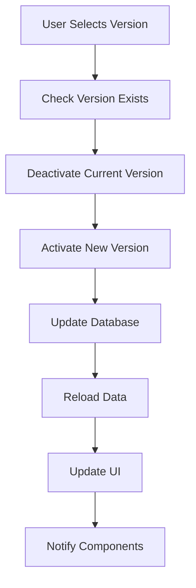
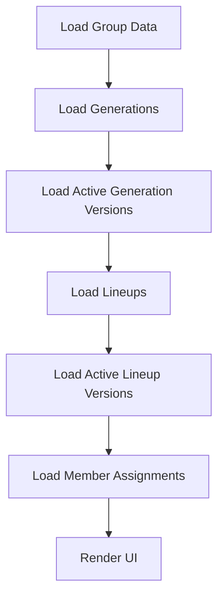
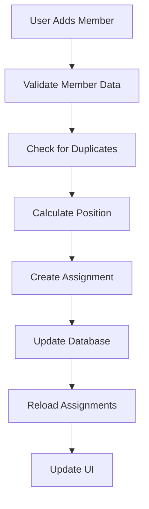

# Version Systems Hierarchy & Relationships

## Overview

This document defines the hierarchical structure and relationships between Generation Version System and Lineup Version System in the MVDB application.

## Table of Contents

1. [System Hierarchy](#system-hierarchy)
2. [Data Relationships](#data-relationships)
3. [Version Dependencies](#version-dependencies)
4. [Access Patterns](#access-patterns)
5. [Cascade Operations](#cascade-operations)
6. [Data Flow](#data-flow)

## System Hierarchy

### Top-Level Structure

```
MVDB Application
├── Groups
│   ├── Generations (Base Entity)
│   │   ├── Generation Versions
│   │   │   ├── Version 1 (default)
│   │   │   ├── Version 2
│   │   │   └── Version N
│   │   └── Lineups (Base Entity)
│   │       ├── Lineup Versions
│   │       │   ├── Version 1 (default)
│   │       │   ├── Version 2
│   │       │   └── Version N
│   │       │       └── Member Assignments
│   │       │           ├── Assignment 1
│   │       │           ├── Assignment 2
│   │       │           └── Assignment N
│   │       └── Actresses (Base Entity)
│   └── Members
└── Users
```

### Detailed Hierarchy

```
Group (1) ──┐
            ├── Generation (N) ──┐
            │                    ├── Generation Version (N) ──┐
            │                    │                           ├── Metadata
            │                    │                           ├── Description
            │                    │                           └── Active Status
            │                    │
            │                    └── Lineup (N) ──┐
            │                                     ├── Lineup Version (N) ──┐
            │                                     │                       ├── Metadata
            │                                     │                       ├── Description
            │                                     │                       ├── Active Status
            │                                     │                       └── Member Assignment (N) ──┐
            │                                     │                                                   ├── Actress Reference
            │                                     │                                                   ├── Alias
            │                                     │                                                   ├── Profile Picture
            │                                     │                                                   └── Position
            │                                     │
            │                                     └── Actress (N) ──┐
            │                                                       ├── Profile Data
            │                                                       ├── Aliases
            │                                                       └── Images
            │
            └── Member (N) ──┐
                            ├── Profile Data
                            ├── Group Assignment
                            └── Status
```

## Data Relationships

### Primary Relationships

```typescript
// 1:1 Relationships
interface Group {
  id: string
  name: string
  // One group has many generations
}

interface Generation {
  id: string
  name: string
  groupId: string // Foreign key to Group
  // One generation has many versions
  // One generation has many lineups
}

interface GenerationVersion {
  id: string
  generationId: string // Foreign key to Generation
  version: string
  name: string
  // One generation version is active at a time
}

interface Lineup {
  id: string
  name: string
  generationId: string // Foreign key to Generation
  // One lineup has many versions
}

interface LineupVersion {
  id: string
  lineupId: string // Foreign key to Lineup
  version: string
  name: string
  // One lineup version is active at a time
  // One lineup version has many member assignments
}

interface LineupMemberAssignment {
  id: string
  lineupVersionId: string // Foreign key to LineupVersion
  actressId: string // Foreign key to Actress
  actressName: string
  alias?: string
  profilePicture?: string
  position: number
}
```

### Relationship Constraints

```sql
-- Foreign Key Constraints
ALTER TABLE generations ADD CONSTRAINT fk_generations_group 
  FOREIGN KEY (group_id) REFERENCES groups(id) ON DELETE CASCADE;

ALTER TABLE generation_versions ADD CONSTRAINT fk_generation_versions_generation 
  FOREIGN KEY (generation_id) REFERENCES generations(id) ON DELETE CASCADE;

ALTER TABLE lineups ADD CONSTRAINT fk_lineups_generation 
  FOREIGN KEY (generation_id) REFERENCES generations(id) ON DELETE CASCADE;

ALTER TABLE lineup_versions ADD CONSTRAINT fk_lineup_versions_lineup 
  FOREIGN KEY (lineup_id) REFERENCES lineups(id) ON DELETE CASCADE;

ALTER TABLE lineup_member_assignments ADD CONSTRAINT fk_lineup_member_assignments_version 
  FOREIGN KEY (lineup_version_id) REFERENCES lineup_versions(id) ON DELETE CASCADE;

-- Unique Constraints
ALTER TABLE generation_versions ADD CONSTRAINT unique_generation_version 
  UNIQUE (generation_id, version);

ALTER TABLE lineup_versions ADD CONSTRAINT unique_lineup_version 
  UNIQUE (lineup_id, version);

-- Check Constraints
ALTER TABLE generation_versions ADD CONSTRAINT check_generation_version_active 
  CHECK (is_active = false OR (is_active = true AND version IS NOT NULL));

ALTER TABLE lineup_versions ADD CONSTRAINT check_lineup_version_active 
  CHECK (is_active = false OR (is_active = true AND version IS NOT NULL));
```

## Version Dependencies

### Generation Version Dependencies

```typescript
interface GenerationVersionDependencies {
  // A generation version can exist independently
  // But affects lineup data loading
  affectsLineups: boolean
  
  // When generation version changes:
  // 1. Lineup data may need to be reloaded
  // 2. Member assignments may need to be updated
  // 3. UI components may need to refresh
  
  cascadeEffects: {
    lineups: 'reload' | 'update' | 'none'
    members: 'reload' | 'update' | 'none'
    ui: 'refresh' | 'none'
  }
}
```

### Lineup Version Dependencies

```typescript
interface LineupVersionDependencies {
  // A lineup version depends on its parent lineup
  // And affects member assignments
  
  dependsOn: {
    lineup: 'required'
    generation: 'required'
  }
  
  affects: {
    memberAssignments: 'direct'
    ui: 'direct'
  }
  
  // When lineup version changes:
  // 1. Member assignments are reloaded
  // 2. UI components refresh
  // 3. Position calculations may change
  
  cascadeEffects: {
    memberAssignments: 'reload'
    ui: 'refresh'
    positions: 'recalculate'
  }
}
```

## Access Patterns

### Read Patterns

```typescript
// 1. Get all generations for a group
const getGenerationsForGroup = async (groupId: string) => {
  return await supabase
    .from('generations')
    .select('*')
    .eq('group_id', groupId)
}

// 2. Get active generation version
const getActiveGenerationVersion = async (generationId: string) => {
  return await supabase
    .from('generation_versions')
    .select('*')
    .eq('generation_id', generationId)
    .eq('is_active', true)
    .single()
}

// 3. Get lineups for active generation version
const getLineupsForActiveGenerationVersion = async (generationId: string) => {
  const activeVersion = await getActiveGenerationVersion(generationId)
  return await supabase
    .from('lineups')
    .select('*')
    .eq('generation_id', generationId)
    .eq('version', activeVersion.version)
}

// 4. Get active lineup version with members
const getActiveLineupVersionWithMembers = async (lineupId: string) => {
  const activeVersion = await supabase
    .from('lineup_versions')
    .select('*')
    .eq('lineup_id', lineupId)
    .eq('is_active', true)
    .single()
  
  const members = await supabase
    .from('lineup_member_assignments')
    .select('*')
    .eq('lineup_version_id', activeVersion.id)
    .eq('is_active', true)
    .order('position')
  
  return {
    version: activeVersion,
    members: members.data || []
  }
}
```

### Write Patterns

```typescript
// 1. Create generation with default version
const createGenerationWithDefaultVersion = async (data: CreateGenerationData) => {
  const generation = await supabase
    .from('generations')
    .insert(data)
    .select()
    .single()
  
  const defaultVersion = await supabase
    .from('generation_versions')
    .insert({
      generation_id: generation.id,
      version: 'default',
      name: generation.name,
      description: generation.description,
      is_active: true
    })
    .select()
    .single()
  
  return { generation, defaultVersion }
}

// 2. Create lineup with default version
const createLineupWithDefaultVersion = async (data: CreateLineupData) => {
  const lineup = await supabase
    .from('lineups')
    .insert(data)
    .select()
    .single()
  
  const defaultVersion = await supabase
    .from('lineup_versions')
    .insert({
      lineup_id: lineup.id,
      version: 'default',
      name: lineup.name,
      description: lineup.description,
      is_active: true
    })
    .select()
    .single()
  
  return { lineup, defaultVersion }
}

// 3. Activate version with cascade effects
const activateVersionWithCascade = async (
  type: 'generation' | 'lineup',
  id: string,
  versionId: string
) => {
  // Deactivate all versions
  await supabase
    .from(`${type}_versions`)
    .update({ is_active: false })
    .eq(`${type}_id`, id)
  
  // Activate selected version
  await supabase
    .from(`${type}_versions`)
    .update({ is_active: true })
    .eq('id', versionId)
  
  // Trigger cascade effects
  if (type === 'generation') {
    // Reload lineup data
    await reloadLineupData(id)
  } else if (type === 'lineup') {
    // Reload member assignments
    await reloadMemberAssignments(id)
  }
}
```

## Cascade Operations

### Delete Cascades

```typescript
// 1. Delete group cascades to generations
const deleteGroup = async (groupId: string) => {
  // This will cascade to:
  // - All generations in the group
  // - All generation versions
  // - All lineups in generations
  // - All lineup versions
  // - All member assignments
  
  await supabase
    .from('groups')
    .delete()
    .eq('id', groupId)
}

// 2. Delete generation cascades to versions and lineups
const deleteGeneration = async (generationId: string) => {
  // This will cascade to:
  // - All generation versions
  // - All lineups in the generation
  // - All lineup versions
  // - All member assignments
  
  await supabase
    .from('generations')
    .delete()
    .eq('id', generationId)
}

// 3. Delete lineup cascades to versions and assignments
const deleteLineup = async (lineupId: string) => {
  // This will cascade to:
  // - All lineup versions
  // - All member assignments
  
  await supabase
    .from('lineups')
    .delete()
    .eq('id', lineupId)
}
```

### Update Cascades

```typescript
// 1. Update generation name cascades to default version
const updateGenerationName = async (generationId: string, newName: string) => {
  // Update generation
  await supabase
    .from('generations')
    .update({ name: newName })
    .eq('id', generationId)
  
  // Update default version name
  await supabase
    .from('generation_versions')
    .update({ name: newName })
    .eq('generation_id', generationId)
    .eq('version', 'default')
}

// 2. Update lineup name cascades to default version
const updateLineupName = async (lineupId: string, newName: string) => {
  // Update lineup
  await supabase
    .from('lineups')
    .update({ name: newName })
    .eq('id', lineupId)
  
  // Update default version name
  await supabase
    .from('lineup_versions')
    .update({ name: newName })
    .eq('lineup_id', lineupId)
    .eq('version', 'default')
}
```

## Data Flow

### Version Activation Flow



### Data Loading Flow



### Member Assignment Flow



## Conclusion

This hierarchy and relationship documentation provides a comprehensive understanding of how the version systems interact within the MVDB application. Understanding these relationships is crucial for:

1. **Data Integrity**: Ensuring referential integrity across all related entities
2. **Performance**: Optimizing queries and data access patterns
3. **Maintenance**: Understanding cascade effects when making changes
4. **Development**: Implementing new features that interact with the version systems

For additional details on specific implementations, refer to the individual system documentation or the implementation guide.
